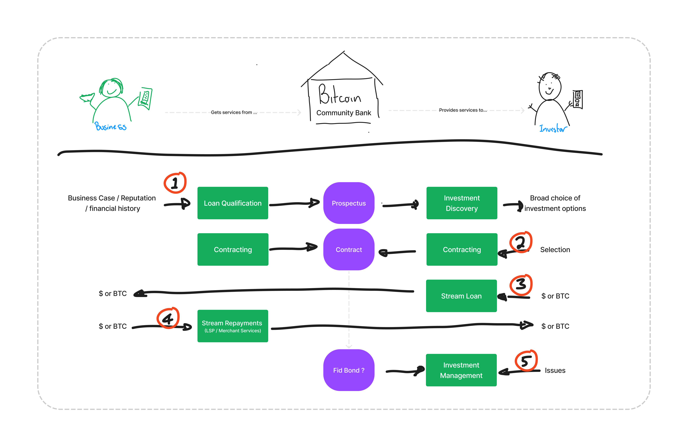

# Community Banking - P2P Capital Markets
### or 
## Real Yield > Potemkin Yield

There has recently been an awful lot of "rah rah" around the concept of volcano and bitcoin bonds.

Whilst I like the iea of freedom from the IMF, centrally planned and issued investments have never felt like the most "bitcoin" way to open up the country to the transformative power of international finance. 

Perhaps, it would be better to return to what worked well, bottom up community driven solutions.

The purpose of this concept is to explore, in an open source environment, a design for the delivery of international investment markets powered by bitcoin. 

To understand how people can use bitcoin to invest in captial formation where it is most required without the requirement for a single centrally planned state actor to dictate the terms and disbursements of funds.

Instead this design will make use of a network of private / community banks who can manage and mitigate credit risks and make this market.

This will allow the global bitcoin industry to "put bitcoin to work" in order to create productive enterprises and drive real yield. 

In many ways you could consider this the "real defi", decentralized peer to peer financing in order to drive real yields, from real businesses. 

---

### The Concept

Broadly speaking the community banks acts as a middleman (I know, but this is a useful service) to facilitate investors and derisk the loan on behalf of the business.

On behalf of the investor the bank would contract the loan and assist with the management of repayments on behalf of hte investor. Where there is disputes these can be taken up with the investor and potential bank capital could be at risk (if fidelity bonds are posted to assist in securing loans).

The process is expected to flow as follows: 

1. Local business develops a business case for investment and works with the bank to qualify this and present to the investor audience. 
2. Investors (globally) are able to browse offers across multiple banks (along with stats on repayments), a loan is selected and contracts, payment milestones and repayment terms are agreed.
3. The investor can stream payments to business as dictated in the contract terms, the community bank may act as a LSP in order to facilitate this transfer.
4. The bank assists the business with streaming repayments back to the investors - example this could be integrated with merchant services allowing a revenue split as income is generated. 
5. Where repayments are not made or issues arrise confict resolution process could be followed between investornad bank.

The process of making the loan, transfering funds and repayment is mechanically fairly simple, so whilst it will be documented it's unlikely to set anyones fire alight. 

The elephant in the room however, is risk of default leaving the investor high and dry and losing funds that can't be recovered due to the irreversable nature of bitcoin transactions. 

Whilst there is unlikely a simple silver bullet solution here, there are several strategies that can be taken to mitigate the risk which will be a large focus of this design. 

### Personas

This design revolves around three actors. 

1. The business owner
2. The community bank
3. the Investor

#### The Business Owner

#### The Community Bank

#### The Investor

### Example Scenarios

---

## Risks

As indicated above this design has been heavily influenced by attempting to mitigate a number of risks. 

### Risk: Credit Default

In this situation the business accepting the loan, takes receipt of the funds for the loan and defaults on the repayments. Given the investor may be remote, anonymous or outside of the local jurisdiction there is little legal recourse they can take in order to receive funds.

### Strategy - Leverage local banking knowledge and network 

Local community banks provide a great opportunity to arrange, support and de risk peer to peer lending.

The major risk is accentuated as the investor doesn't share a local jurisdiction with the business taking the loan.

This is not true of local banks and even less so with community banks, which by design are inherently close.to and integrated in to the community.

They are uniquely positioned to identify robust businesses and opportunities and make these available to the global bitcoin market.

By sharing legal and community jurisdictions with the business seeking investment they can act on behalf.of the remote investor to ensure repayments are made.

Of course nothing stops a community bank acting in concert with a business to defraud an investor, however it is significantly harder to "rug pull" an entire bank from a community and move it elsewhere. This bank defrauding investors would thus lose access to future capital and severely impact the community and local entrepreneurs who can apply pressure to keep things honest.

Furthermore we can use further strategies to further mitigate these issues.

### Strategy - Streaming of loan funds

### Strategy - Recovery at Merchant PoS

### Strategy - Community bank posts bond 

MORE TO FOLLOW
