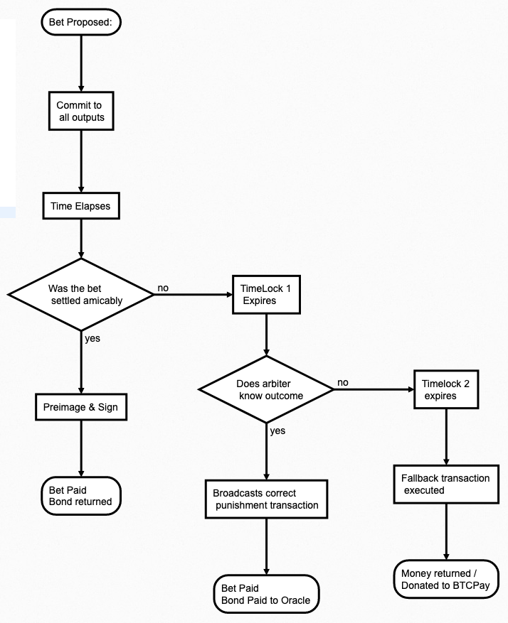
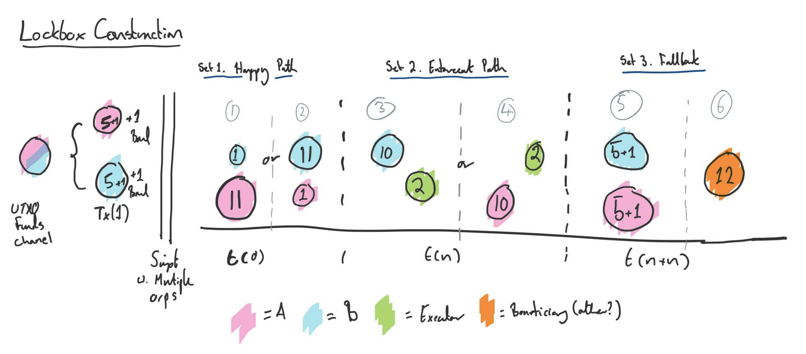
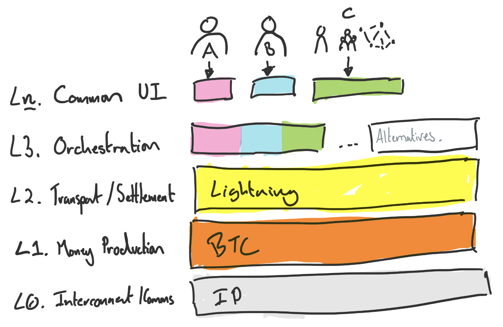

# Lockbox Transaction Construction

#### A framework for reliable, freemarket enforcement of deterministic contracts on bitcoin.

***Note*** This is provided as an unfinished high level concept seeking feedback! 

---

## The Tl;dr's Tl;dr

A lockbox creates a pre-approved set of transactions and fee payments which can reliably be enforced by off chain service providers.  This could facilitate a market for Oracle / Enforcement services without the requirement for tokens / altcoins.

---

## The Tl;dr.

At a high level the concept works as follows:

* The Lockbox interactive signing protocol would allow peers to agree to the timing and enforcement terms as part of an interactive contract setup, which results in payments being made.

* A set of pre-signed transaction are generated which incentivise honest settlement in peer-to-peer contracts / payments.

* These transactions provide a ***hook*** for off-chain "enforcement by service providers" to enforce contracts for a fee.

* A market of enforcement services can offer services at differentiated price points competing on trade offs around privacy, security, trustlessness, speed and counter party risk.

* The enforcement service is effectively being trusted to correctly sign and broadcast a transaction which includes the result of an outcome.

* The service provider must therefore have real world knowledge of the contract outcomes as such we expect this to develop a marketplace in which various businesses would compete.

* Non-economic 'side-chains' which sign specific "facts" can provide a good balance of specialist knowledge, verification, redundancy and cost.

* Final settlement of contracts would be dependant on inclusion in bitcoin blocks, however, deployment in channel factories allows the instant settlement of contracts thorugh lightning channels offchain. 

* No tokens are required.  All transactions are pre-signed and settle via lightning (require's eltoo).

I believe this approach which respects the decoupling **money** from **contracts** will be essential in allowing agents to transact in a free market for smart contract execution at efficient pricing points. 

---

## The Lockbox

The proposal is to have all parties in a contract pre-commit to a set of transactions which could be settled to the bitcoin blockchain.  

This transaction set includes all relevant outputs as part of the redemption script, payment collatoral and an agreed bond/fee.  

These outputs will ensure that money is correctly paid in line with the agreed terms of a deterministic contract at the agreed times.

As the contract concludes (specified in blocktime) either party can sign a transaction in order to cede the bet to the other party in a cooperative manner. This is simply the equivalent to a user confirming a payment in a lightning channel, by updating the state.

In the case in which parties disagree, at an agreed timelock a set of arbitration transactions (held with a 3rd party enforcement service provider - my god!) can be broadcast which allow this service provider to claim a fee (a bond posted to the contract)  and pay out the contract correctly.

In the case where this transaction isn't broadcast a third set of timelocked transactions could provide a fallback state for example e.g. return funds, donate to Tor/BTCPay etc.

The following diagram shows this flow.

```flowchart
st=>start: Bet Proposed:
e=>end: Bet Paid
Bond returned
e2=>end: Bet Paid
Bond Paid to Oracle
e3=>end: Money returned /
Donated to BTCPay

op0=>operation: Commit to 
all outputs
op1=>operation: Time Elapses
sub1=>subroutine: My Subroutine
cond=>condition: Was the bet 
settled amicably
op2=>operation: TimeLock 1 
Expires
op3=>operation: Preimage & Sign
cond2=>condition: Does arbiter 
know outcome 
op4=>operation: Broadcasts correct 
punishment transaction
op5=>operation: Timelock 2 
expires
op6=>operation: Fallback transaction 
executed


io=>inputoutput: catch something...

st->op0->op1->cond
cond(yes)->op3->e
cond(no)->op2->cond2
cond2(yes)->op4->e2
cond2(no)->op5->op6->e3
```



A minimum of three parties are required in order to execute this contract:

- **Party A:** Provides funds/bond, generates pre-images and pre-signs transactions.

- **Party B:** Provides funds/bond, generates pre-images and pre-signs transactions.

- **Oracle:** Service provider who holds a set of punishment transactions and can earn bond fees, if these are required at a future point in time.

This closely mimics a real life "betting" arrangement in which a third party is selected to  hold funds in escrow and ensure the payout to the winner. 

 In this case we incentivise  indivudal parties to resolve contracts gracefully in order to avoid losing their bond.

This is setup is achieved through the following transaction construction.



**Set 1: Happy Path**

Includes two pre-signed t(x).  

The redemption script requires a pre-image to be supplied to redeem the script.  Each party generates and holds the pre-image which pays out the fuinds to the opposing party.

As such at any time they can reveal this at any time allowing their counterparty to close out the bet successfully with bonds returned to each party.

> ***Note:*** A fee which will be paid to the Oracle could optinally also be included even if the contract is closed on the happy path in order to ensure that the enforcement service is paid.

**Set 2: Enforcement Path**

This will again include two pre-signed t(x) mimicing set 1.  In this case the bond amount is paid out to the enforcement surface provider.  

Each of these transactions is also timelocked to 'n' blocks after the contract expiration meaning the two parties will always have the opportunity to redeem the contract prior to this.

In order to redeem against these the Service Provider will have to provide evidence of an outcome and the hash of a contract script.  Basicallly they reveal a secret which can be verified by the parties involved in the bet.

**Set 3: Fallback**

This allows a final action to be specified "in case of emergency beak glass".  For example the funds could default to be returned to original owners if no action is taken or even burnt ot better yet donated to a community project (like Tor or BTCPay Server).

This also provides more impetous to both the parties and/or the Oracle to ensure the contract is settled in an appropriate amount of time. 

***Note*** All transactions will need to be formatted in the manner of channel factory **"Replaceable allocations"** including kick off and invalidation transactions.  More information on [channel factory construction is availabe in the whitepaper](https://www.ncbi.nlm.nih.gov/pmc/articles/PMC6124062/).

--- 

### Third Parties and Oracle Problems

I'm going to expand on this in the article "Smart Contracts will be hired" but, this is based on the view that what we're actually doing in a smart contract environment is... 

> Paying a '3rd party' to ensure a set of deterministic steps are taken resulting in a payment, for a set of funds held for a finite time.
> 
> The 3rd party often just happens to be a computer.

As such the platform debate revolves around the nature of this 3rd party, with a recognition that the Oracle Problem will still exist in all cases. 

This is largely resolved in the real world by utilising people, companies and institutions which stake their reputation on enforcing contracts.  

The same concept can be applied with Bitcoin in which we have a range of options from a simple arbitration contract in which a third party holds a key and has arbitration responsiblities in case of a disagreement (e.g. Hodl Hodl predictions).

Likewise these solutions will cover the entire complexity scale from single people, to groups, to companies, to federations and standalone open public blockchains.

The purpose of the lockbox construct is not to solve this Oracle problem, but instead to provide a means for any of these possible solutions to interact with the bitcoin contract.

As such we could rationaly expect a market to develop in which many online institutes compete to "publicly sign facts" and provide "enforcement services" in which they stake their public reputation in return for fees.  Assuming that smart contracts are deemed valueable on the free market. 

The correct solution for automated contract enforcement would therefore, be decided on in a competitive market in which free agents assess the various leves of trust minimisation, counterparty risk and cost.

This decoupling of monetary system and the contact will allow the price of contract execution to be discovered outside of the cost of securing the money.

For instance we would expect that it would always be cheaper to hire a single individual, that two parties trust to adjudicate a contract, than it would be to hire a world computer to enforce contract execution.

---

### High Level Archiecture

Ok so lets quickly recap on what we've got so far.

* A transaction construction which incentivises two parties to conduct business directly and settle their contracts in a trueful manner.

* A transaction construction which provides funding to **pay a service fee** for this enforcement to ensure it happens.

* A concept that there will be multiple ***off chain services*** to enforce this contract execution.

To provide some further contact we'll llook at architectually, how this fits into the bitcoin technical ecoystem. 

We'll borrow the HL layered view of bitcoin (discussed fiurther in Bitcoin Cake -sorry carnivores).



The purpose of each layer is as follows:

* **L0 Interconnect / Comms:**  A common IP network is required to ensure the parties can adequetly conntect, transfer information and access bitcoin and lightning networks.

* **L1 Money Production:**  The security, verification, issuance and ownership of the money used in contracts will be provisioned and enforced by the bitcoin network as multisig UTXOs.

* **L2 Transport/Settlement:**  The instant settlement of funds is achieved thorugh lightning network channels anchored to the bitcoin UTXOs in a channel factory construction.

* **L3 Orchestration:**  Is the concept of having systems to reliably enforce an outcome based on a set of deterministic rules.  This is achieved in a seperate layer which sits above the lightning network through the lockbox construction.  Lockbox provides an incentive for settlement and provides a "tx-hook" for a third party signing service to ensure execution.

* **L<u>n</u> UI:**  The top layer is of course the UI layer in which we need to coordinate the signing ceromonies and verification checks on the the bitcon and lightning network to establish a lockbox.  Effectively a bitcon/lightning wallet (wallet is so the wrong word...) which supports lockbox construction. 

#### Transaction Hooks

> Hey Pete you can't just say tx-hook and leave it at that, this seems like it might be important!

Sorry!

> tx-hook = transaction hook.

Simply put, this is the "enforcement transaction set" which allows the third party to enforce the contract at their descretion and the piece of information which needs to be provided in order to include this transaction successfully in a bitcoin block.

This can be achieved under current bitcoin consensus rules by:

* revelaing a hash pre-image, or

* providing a signature,

* after a specific block height.

So the real trick for orchestration layer is to consider what clever tricks we have to generate, secure and use pre-images and signatures in off chain services/protocolls to enforce pre-commitments in on chain payments.

Here we borrow from the work done in channel factory development for lightning.

Here's we're going to assume that the transaction hook is a hashed pre-image generated interactively by the opposing contract "partner" and the Enforcement Service Provider.

This will be a valid transaction output ready for broadcast only during the contract  enforcement period.

A psudo-code pre-signed transaction output signed in the enforcement path will have the following style of redemption script. 

In this instance each party would sign a version of this transaction which concludes the contract in favour of their counterpraty.

```
Redeem if 
    - blocktime > n
    - hash(pre-image) == 23hju34nonsense8createdjkj..duringcontract8setup
Output
    - Pay out to counterparty
    - Pay out bond to pre-selected Oracle address
```

***Note:*** Creation of this pre-image hash does not need to be **"on the blockchain"** indeed it could be 1 person, a Shamir Secret Sharing scheme or simply a pre-image generated from another off chain coordinated action.

### Orchestration Markets and Facts

An orchestration market is a marketplace of providers for the service of orchestrating bitcoin contract enforcement, simply described the service provider wil do the following:

> At a pre-agreed time, I will fact check some data and publically commit to this fact.  
> 
> I will also use this data to generate a pre-image that will allow me to claim a bond in a contract paid in bitcoin in rerturn for this service.

This is termed an orchestration market as the maner in which this service could be provided could be accomplished in a multiutude of different ways.  

For example:

- **Simple:** I am Dave and on my website I will list the following facts about the results of football matches. They will be signed and can be validated with this puiblic key.  **For a price** I'll even provide a hash image and generate a new bitcoin transaction on lightning for you.

- **Complex:** I am a decentralised world computer running on millions of nodes around the world.  I also host prediction markets where people can bet on real world outcomes in order to establish facts within a reasonable confidence and manage arbitration of this for you.  This even works or football games!  **For a price** I will assess any contract you can write and install on me. I will run this contract on every node in my network with zero downtime and pay out a transaction for you. 

- **Somewhere inbetween:** We are a network of signers around the world. We follow all follow football matches and have been signing results on this open network for years now, using this public key. **For a price** we'll even agree to broadcast a particular transaction in line with these results and commit to this in a transparent manner.

#### Dave - a worked example with some flaws.

We could imagine from the above example that Dave (see below), might be able to out compete the world computer in terms of price and could be a natural choice to resolve a bet on a game of football, particularly if he's known to the betters.

So lets look at how we'd accompllish this before we start to explore the potential trade offs (I know seems like there could be nothing that goes wrong here).


So in this instance we have the following scenario.

- Alice bets 1 btc team A wins and is willing to pay up to 0.01 BTC to place the bet. 

- Bob bets team B wins and is willing to match Alice's terms.

- It is decided that DaveNet will be used to adjudicate the bet.

- A lockbox is created (using some software which we'll come to later) in which Dave can broadcast one of two transactions.

If A wins the game, Bob signs a message to this effect on his website and then has the option of redeeming Transaction 1.

```
Outputs    
    - Pay Dave Bob's bond (0.1 btc)    
    - Pay Alice Bob's (1 btc) AND Pay Alice Alice's Bet and Bond (1.1         btc)
IF     
    - Blockheight > n
    - hash(pre-image) == awholebunchofrandomnonsensejkalsdjfluhsjfnj
WHERE    
    - awholebunchofrandomnonsensejkalsdjfluhsjfnj ==         hash(bettingscript(outcome)+BOB-NONSENSE)
```

If B wins the game, Bob signs a message to this effect on his website and then has the option of redeeming Transaction 2.

```
Outputs
    - Pay Dave Alice's bond (0.1 btc)
    - Pay Bob Alices bet (1 btc) AND Pay Bob Bobs Bet and Bond (1.1 btc)
IF 
    - Blockheight > n
    - hash(pre-image) == awholebunchofrandomnonsensejkalsdjfluhsjfnj
WHERE
    - awholebunchofrandomnonsensejkalsdjfluhsjfnj ==
         hash(bettingscript(outcome)+ALICE-NONSENSE)
```

The crux  is that Dave can deterministicly generate two random hash pre-images prior to the outcome of the contract which allows us to pre-sign transactions which Dave can hold for enforcement.

However he can't actually use these before the pre-agreed enforcement time.

It is important that Alice isn't able to generate the pay Alice transaction i.e. ***transaction 1***  as she could quickly broadcast this prior to Dave in order to welch on the bet. 

We protect this by adding noise to the pre-image which is provided by the individual who would "lose the bet" i.e. ***transaction 1*** is only valid if it includes information that only Bob could have provied.

Instad of random noise, here we're going to create this "noise" by signing the redemption script inluded outcome, with Bobs private key.  

That way using the public key we can always prove at a later date that the opposing party did in fact agree to this.

This ensures that the opposing party couldn't guess the outcome hash and broadcast this themselves before Dave, i.e:

- Only Bob can generate the pre-image which would cede the bet to Alice.

- Only Alice can generate the pre-image which would cede the bet to Bob.

- Dave knows both pre-images, however he can only use them in specific and they only pay him an amount of the bond.

So we now have a situation in which DaveNet could provide a service in which he publishes facts on the internet and stores small transacitons, which allows Bob and Alice to make a trust-minimised peer-to-peer bet.

In this instance this could be all we need.  It's cheap simple and accomplishes a goal in a trust minimised way.  

In this instance this is minimised as the funds in the contract are never actually controlled or can be stolen by Dave, he could however broadcast the incorrect result, which brings us nicely to the trade offs.

##### Are there really any trade offs to DaveNet?

Of course, despite the respectable shorts there's a few questions that could be raised here:

- **Privacy:** Do we want Dave to know so much about our betting habits and would he become a privacy honeypot?

- **Censorship Resistance:** Could Dave be corrupted by the government or bribed by the counterparty to broadcast the incorrect transaction?

- **Transparency:** Can we validate that the correct transaction was broadcast and this matches the result Dave stakes his public reputation on?

- **Redundancy:** What happens if DaveNet is down for a week, the contract enforcement period expires and we end up sending the funds to a charity!

- **Speed:** How quickly can Dave resolve this contract? 

- **Cost:** Is there a cheaper way of achieving this? 
  (maybe but do you really want to trust Dave's cheaper, knock off cousin Lloyd ni charge!?)

There are of course potential ways to solve some of these issues, by optimising for different trade offs e.g. increasing privacy and redundancy.  These are trade offs though so optimising for one or many will of course mean taking a hit elsewhere.  

If nothing else it will become expensive (which some transactions may still justify) to  improve in each of these areas.

This is chiefly why we believe a market for Orchestration services will develop with different optimisations, trade offs and track record of execution being used to drive various price points.

---

## Enforcement Services Approaches

As discussed lockbox doesn't seek to solve the Oracle Problem here, but just to provide a hook for different services to plug into. 

At a high level some examples we might expect to emerge are:

- Individuals

- Community Groups

- Government Oragnisations

- Businesses

- Federations Signing Networks

- Public blockchians.

- All of the above with different privacy fundamentals...

In order to provide an example of how this might work I'll expand on the Federated Signing Network as I believe that this is a good trade off (but what do I know this is what markets are for).

#### Federated Signing Networks

A federated signing network is effectively a side chain like liquid, however, without the requirement for a token or peg in/out mechanism is bitcoin never required to move to this chain.  

The purpose of this side chain would be to produce blocks that record facts, execute contract code and generate outputs which will correspond to the relevant pre-image required as our transaction hooks.  

This pre-image is used to settle the transaction output which pays the contract and the bond/fee's to a bitcoin multi-sig address/channel controlled by the keys of the network signers. 

All outputs are signed and verified on this chain (by the other signers) and the chain itself can be publically inspected and or verified to provide "reputation" stats for how well the chain performs over time. For example in order to drive a premium price point through a consistent "good" behaivour.

**The Benefit:**

- **Censorship Resistance:**  In this instance we can distrbute the nodes geographically, politically etc in order to provide better censorship resistance than DaveNet.

- **Transparency:** Be maintaining a public record of facts, scripts and redemption images it is posisble to verify the reputation of any particular opensrouce signing network. An individual may not take this on themselves, however, you could image a world of indepent reviewers publishing maintaining infrasructure and statistics on this. 

- **Trust Minimisation:** At no point can the network steal your funds, they will only get paid their agreed bond when you fail to rquitably enforce your own contracts.

- **Redundancy:** This network could for example be '50 nodes', distriobuted all over the place and only a quorom would be required to enforce the contract. 

- **Speed:** unsure if there's any real good or bad on this one.

**The Trade Offs:**

- **Privacy:** This doesn't do much for our privacy as all of the data we were unsure of with DaveNet is now publically accessible on the a public side chain. 

- **Censorship Resistance:** This isn't bitcoin its a federation, should this chain be compromised or co-opted by an outside influence e.g. the state then this could be comprimised.  Given this 

- **Costs:** There isn't a binary output, but we can assume that the cost to run the distributed infrastructure in this network will be higher than DaveNet's website for one.

#### Zero Knowledge Proof / Confidential Transactions

< WIP - need to work on how ZK Proof / CT could be used to improve privacy > 

Publically recording the outputs of any particular bet and the contract script for verification purposes. i.e. having the redeem script executed in the signing chain or on DaveNet is likely not really a private system.

Could instead provide range proofs which show the output of the bet with a view that this was correctly interperetted. 

The people involved in the bet, would have an abilty to "decode" this proof and vouch for the result. 

---

## Creating a Lockbox (UI / UX Orchestration)

In order for this to work, there will need to be an interactive process to agree terms.

< **TODO:** need to draw out the transaction outputs and how each is verified by the contract participants prior to agreeing the bet >

< **TODO:** Build out interacticve prototype which demonstrates flow >

---

## FAQs

In reality these are my own objections that I'm raising along the way to make sure I steelman this after!

**Q:** So a main limitation at the moment would be that the outputs of the UTXO need to be known?
Yep this seems to be correct at the moment, I guess you could stagger payments and stream them ala lightning e.g. outcome is not binary but x out of y. as such you could have the oracle stream upto x payments to a and y-x to b.


**Q:** So we still have an Oracle Problem then? 

Yep. pont here is to solve this with a free market of service providers, as is already hapening ala Hodl hodl - prediction market.


**Q:** How do we validate the real world facts? 

**A:** Needs to be part of the lockbox setup to ensure that the signer has specific Oracle capabilities and these are shown. The inabilty of 1 network to cover and observe many "real world facts" is one reason why we believe there will be a market of different providers in this area.


**Q:** Could signing chain censorship resistance be improved by the adotion of state chains??

**Q:** What if the Oracle doesn't know the outcome?

**Q:** Can the Oracle Punish the transaction and claim the bond anyway?

**Q:** Why would the Oracle bother enforcing transaction if the assumption is they will never be used given incentives?

**Q:** Are all transaction visible to the Oracle?

**Q:** Can I have multiple Oracles? 

**A:** You bet! Just adjust the time outs appropriately.

**Q:** What about outsized circumstances e.g. in the football bet the game never happens - whats the mutual escape hatch? 

**A:** At any point in time the "lockbox" merely represents a set of pre-signed transaction in a channel balance which is a 2 of 2 multisig. As such the two parties could always collude prior to the contract enforcement period in order to broadcast an alternate UTXO and invalidate the transaction (this needs somet thinking about).


**Q:** How do we make sure that the ransactiopn which are broadcast match the attetations on bobs website..

**Q:** Enforcement services could provide templated SC's and fees to make this much quicker to setup and pre-agree.


**Q:** Could I DDOS someone expecting a contract to close in order to force this to the Oracle? 
