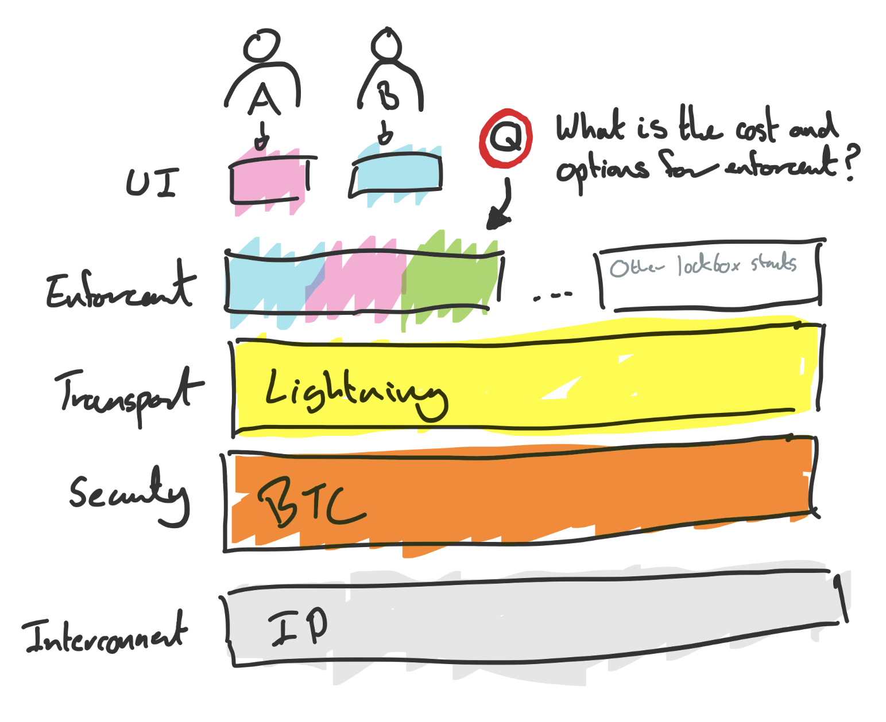

# Lockbox Transaction Construction

#### A framework for offchain reliably enforced, trust minimised smart contract enforcement in bitcoin.

***Note*** This is provided as an unfinished high level concept seeking feedback! 

---

#### The Tl;dr's Tl;dr

A lockbox creates a pre-approved set of transactions and fee payments which can reliably be enforced by off chain service providers.  This could facilitate a services market for Oracle / Enforcement services without the requirement for tokens / altcoins.

---

#### The Tl;dr.

At a high level the concept works as follows:

* The Lockbox interactive signing protocol would allow peers to agree to the timing and enforcement terms as part of an interactive contract setup.

* A set of pre-signed transaction are generated which incentive honest settlement in peer-to-peer contracts / payments.

* These transactions provide a ***hook*** for off-chain "enforcement service providers" to enforce contracts for a fee.

* A market of enforcement services can offer services at differentiated price points based on trade offs around privacy, security, trustlessness, speed and counter party risk.

* The enforcement service will have arbitration rights on the contract and must therefore have real world knowledge if required about the contract outcomes.

* Non-economic 'side chains' can provide a good balance of specialist knowledge, verification, redundancy and cost.

* Final settlement of contracts would be dependant on inclusion in bitcoin blocks, however deployment in channel factories allows the instant settlement of contracts thorugh lightning channels offchain. 

* No tokens are required.  All transactions are pre-signed and settle via lightning (require's eltoo).

We believe this approach which respects the decoupling **money** from **contracts** will be essential in allowing agents to transact in a free market for smart contract execution at efficient pricing points. 

---

### The Lockbox

The proposal is to have both pre-commit to a set of transactions which could be settled to the bitcoin blockchain which include both the payments as collatoral and an agreed bond.  

These outputs will ensure that money is correctly paid in line with the agreed terms at the agreed times.

As the contract concludes (specified in blocktime) either party can broadcast a secret in order to cede the bet to the other party, allowing the other party to sign an output and claim the btc.

In the case in which parties disagree, at an agreed timelock a set of arbitration transactions (held with an oracle - more details later) can be broadcast which allow the Oracle to claim the bond  of the losing party and pay out the bet for the winning party.

In the case where this fails a third timelocked set of transactions will default to a fallback set of outputs e.g. return funds, donate to Tor/BTCPay etc.

The following diagram shows this flow.

```flowchart
st=>start: Bet Proposed:
e=>end: Bet Paid
Bond returned
e2=>end: Bet Paid
Bond Paid to Oracle
e3=>end: Money returned /
Donated to BTCPay

op0=>operation: Commit to 
all outputs
op1=>operation: Time Elapses
sub1=>subroutine: My Subroutine
cond=>condition: Was the bet 
settled amicably
op2=>operation: TimeLock 1 
Expires
op3=>operation: Preimage & Sign
cond2=>condition: Does arbiter 
know outcome 
op4=>operation: Broadcasts correct 
punishment transaction
op5=>operation: Timelock 2 
expires
op6=>operation: Fallback transaction 
executed


io=>inputoutput: catch something...

st->op0->op1->cond
cond(yes)->op3->e
cond(no)->op2->cond2
cond2(yes)->op4->e2
cond2(no)->op5->op6->e3
```


As we can be seen there are at least three actors required in order to execute this contract:

- **Party A:** Provides funds/bond, generates pre-images and pre-signs transactions.

- **Party B:** Provides funds/bond, generates pre-images and pre-signs transactions.

- **Oracle:** Service provider who holds a set of punishment transactions and can earn bond fees.

This closely mimics a real life "betting" arrangement in which a third party is selected to  hold funds in escrow and ensure the payout to the winner.  In this case we incentivise  indivudal parties to resolve contracts gracefully in order to avoid losing their bond.

This is setup is achieved through the following transaction construction.


**Set 1: Happy Path**

Includes two pre-signed t(x).  The redemption script requires a pre-image to be supplied to redeem the script.  The opposing party to the contract holds this pre-image as such they can reveal this at any time allowing their counterparty to close out the bet successfully with bonds returned to each party.

    ***Note:*** A fee which will be paid to the Oracle could optinally also be included even if     the contract is closed on the happy path in order to ensure that the enforcement     service is paid.

**Set 2: Enforcement Path**

This will again include two pre-signed t(x). These will mimic set 1, with the bond in this case from the forfeiter paying the Oracle.  Each of these transactions is also timelocked to 'n' blocks after the contract expiration meaning the two parties will always have the opportunity to redeem the contract prior to this.

In order to redeem against these the Oracle will have to provide the hash of a contract script / plus data points and < CONSTRUCT A HASH OF HASHES TO PROVE SCRIPT >.

As may become clear all of the trade offs in this sense hinge on how we can provide this final signature, which we'll cover in the next session.

**Set 3: Fallback**

This allows a final action to be specified in final transaction set. For example the funds could default to be returned to original owners if no action is taken or even burnt ot better yet donated to a community project (like Tor or BTCPay Server).

This just provides more impetous to both the parties and/or the Oracle to ensure the contract is settled in an appropriate amount fo time. 


***Note*** All transactions will need to be formatted in the manner of channel factory **"Replaceable allocations"** including kick off and invalidation transactions.  More information on [channel factory construction is availabe in the whitepaper](https://www.ncbi.nlm.nih.gov/pmc/articles/PMC6124062/).

--- 

### Contract Enforcement

##### But Pete - how does any of this actually happen?

Glad you asked...

As we covered in the article "Smart Contracts will be hired" what we're actually doing in a smart contract environment is paying a '3rd party' to ensure a set of coded steps are taken, its just the 3rd party is a computer.

As such the platform debate revolves around what this 3rd party looks like. For instancein Etheruem 3rd Party means "all ethereum full nodes" - yep both of them ;) or in liquid you would be asking all ***xyz*** validators.

Interestingly we start to see that this final signature does not need to be **"on the blockchain"** indeed it could be 1 person, a Shamir Secret Sharing scheme or has pre-image which is released from other coordinated action. 

> **SPOILER ALERT**
> 
> This decoupling between the monetary system and the contract execution / enforement is going to be massively important in driving down the cost of contract execution in a competitive environment.
> 
> **SPOILER ALERT**

Just to reinforce this blunt quip the idea here is it would always be cheaper to hire that one person two parties both trust to sign a transaction, than to hire a world computer in order to enforce execution.

The correct price for contract execution will of course be best be decided on in a competitive market for contract execution in which agents assess the various leves of trust minimisation, counterparty risk and cost.

As such we'd expect a market of options to provide this service. 

---

### The Tech Stack

Ok so lets quickly recap on what we've got so far.

* A transaction construction which incentivises two parties to conduct business directly and settle their contracts in a trueful manner.

* A transaction construction which provides funding to **pay a service fee** for this enforcement.

* A concept that there will be multiple ***off chain services*** to enforce this contract execution.

So there are now two obvious (and related) questions staring us in the face at this point:

1) What does this market look like.

2) How does is interact with the lockbox.

In order to answer this we're going to dip into the Bitcoin Cake concept (sorry carnivores) as highlighted in the diagram below.



So the layers and purposes we're looking for are as follows:

* **L0 Interconnect:**  Assumes both parties can communicate via a common IP network e.g. the internet.

* **L1 Money Production:**  The security, verification, issuance and ownership of the money will be provisioned by the bitcoin network, utilising multisig utxos utilising channel factories.

* **L2 Transport/Settlement:**  The instant settlement of funds is achieved thorugh lightning network channels as part of the channel factory construction.

* **L3 Enforcement:**  Is achieved by pre-signing the lockbox transaction contruction with an incentive for settlement and opportunities to hook in a third party signing service to ensure execution.

* **L4 Orchestration & UI:**  Is achieved in the user interface layer, by ensuring that all parties follow a clear signing protocol in order to setup the lockbox, agreeing on the enforcement criteria and putting the relevant "tx-hooks" in place.  This will be achieved by running a common application stack which both respects these protocols and sits on top of the Bitcoin and Lightning node stack.

The wise reader will at this point have realised that we just introduced one new concept - sorry about that!

So what the hell is a tx-hook? 

> tx-hook = transaction hook.

Simply put, the lockbox provides an "enforcement transaction set" which is essentially a hook which allows an off chain service provider to ensure enforcement of this contract.  

This can be achieved under current bitcoin consensus rules by:

* revelaing a hash pre-image, or

* providing a signature,

* after a specific block height.

So the real trick here is in the orchestration layer.  In this layer we will seek to use clever tricks to generate, secure and use pre-images and signatures in off chain services/protocolls in order to enforce on chain payments.

As such we're now going to drill into the tx-hooks and orchestration layer, before we come back to what some example services might emerge on the market to meet this need.

### Transaction Hooks

Its all about keys and secrets baby.

I feel there's a point in every bitcoiners journey  where you think...

> Should I start just randomly guessing private keys? 
> 
> These things are just numbers what if I guessed the right one and there was a 1000 BTC in there.

This is forgivable as infinity and massive numbers really aren't intuitve in any way to numbers.  It really hit home to me when someone mentioned there were less atoms in the observable universe that the number of combintations in a private key. 

This same is true for pre-images. We're basically locking up money in a way that can only be spent if you happen to know a secret where the chances of guessing the secret are functionally infinite.

This is interesting as we now have a piece of random data, which can't be guessed, but when presented in the correct window of time will allow contract enforcement.

This is how we're going to implement our transaction hook in our little thought experiment.

Simply put the pre-signed transaction outputs signed in the enforcement path will have the following style of redemption script.

```
Redeem if 
    - blocktime > n
    - hash(pre-image) == "hash provided at setup"
    - < other logic spending utxos to correct participant >
    - < other logic claiming bond to pre agreed Oracle address >
```

So any person, or persons who can provide that pre-image can simply enforce the contract, however, you would only really expect the Oracle to do this as the bond will only ever be sent to them.

### Orchestration Markets and Facts

An orchestration market is simply a decentralised marketplace of providers for a very simple service.

> At a pre-agreed time, I will publically commit to a fact and generate a pre-image that will allow me to claim a bond in a contract.

We call this an orchestration market as the maner in which you provide this service could be accomplished in a multiutude of different ways.  For example:

- I am Dave and on my website I will list the following facts about the results of football matches on my website. They will be signed and can be validated with this puiblic key.  **For a price** I'll even provide a hash image which validates this fact to you.

- < multiple options in between these like side chains, groups of people >

- I am a decentralised world computer running on millions of nodes around the world. **For a price** I will assess any contract you can write and install on me. I will run this contract on every node in my network millions of time with zero downtime. 

#### Taking an Example: How does Dave perform this task

We could imagine from the above example that Dave (see below), might be able to out compete the world computer in terms of price and it seems like he'd be a natural choice to resolve a bet on a game of football, so lets look at how we'd accompllish this before we start to explore the potential trade offs (I know seems like there could be nothing that goes wrong here).


So in this instance we have the followig scenario.

- Alice bets 1 btc team A wins and is willing to pay up to 0.01 BTC to resolve the bet. 

- Bob bets team B wins and is willing to match Alice's terms.

- It is decided that DaveNet will be used to adjudicate the bet.

- A lockbox is created (using some software which we'll come to later) in which Dave can broadcast one of two transactions.

If A wins the game, Bob signs a message to this effect on his website and then has the option of redeeming Transaction 1.

```
Outputs    
    - Pay Dave Bob's bond (0.1 btc)    
    - Pay Alice Bob's (1 btc) AND Pay Alice Alice's Bet and Bond (1.1         btc)
IF     
    - Blockheight > n
    - hash(pre-image) == awholebunchofrandomnonsensejkalsdjfluhsjfnj
WHERE    
    - awholebunchofrandomnonsensejkalsdjfluhsjfnj ==         hash(bettingscript(outcome)+BOB-NONSENSE)
```

If B wins the game, Bob signs a message to this effect on his website and then has the option of redeeming Transaction 2.

```
Outputs
    - Pay Dave Alice's bond (0.1 btc)
    - Pay Bob Alices bet (1 btc) AND Pay Bob Bobs Bet and Bond (1.1 btc)
IF 
    - Blockheight > n
    - hash(pre-image) == awholebunchofrandomnonsensejkalsdjfluhsjfnj
WHERE
    - awholebunchofrandomnonsensejkalsdjfluhsjfnj ==
         hash(bettingscript(outcome)+ALICE-NONSENSE)
```

The real crux here is that Dave can deterministicly generate two random nonsense numbers prior to the outcome of the contract, allowing us to pre-sign transactions against them which Dave can hold. 

If Alice were able to generate the pay Alice transaction then she could quickly broadcast this prior to Dave in order to welch on the bet, so we protect this with a bit of extra ""nonsense" provided by the individual who would "lose the bet".

Whilst we're at it, why don't we create this extra "nonsense" by signing the redemption script with our private key.  That way using the public key we can always prove at a later date that the opposing party did in fact agree to this.

This ensures that the opposing party couldn't guess the outcome hash and broadcast this themselves before Dave, i.e:

- Only Bob can generate the pre-image which would cede the bet to Alice.

- Only Alice can generate the pre-image which would cede the bet to Bob.

- Dave knows both pre-images, however he can only use them in specific and they only pay him an amount of the bond.

So whilst we're at it, why don't we make that nonsense the output of the opposing party signing the redemption script with their private key.  That way using the public key we can always prove at a later data that the opposing party did in fact agree to this. 

So we now have a situation in which DaveNet could provide a service in which he publishes facts on the internet and stores small transacitons, which allows Bob and Alice to make a trust-minimised peer-to-peer bet.

In this instance this could be all we need.  It's cheap simple and accomplishes a goal in a trust minimised way (here I'm defining this as the funds in the contract are never actually controlled or can be stolen by Dave).

However, we could imagine a higher stakes or more private contract where this might not seem like a good enough solution. So lets have a look at the trade offs.

##### Are there really any trade offs to DaveNet?

Of course, despite the respectable shorts there's a few questions that could be raised here:

- **Privacy:** Do we want Dave to know so much about our betting habits and is he just a honeypot?

- **Censorship Resistance:** Could Dave be corrupted by the government or bribed by the counterparty to broadcast the incorrect transaction?

- **Transparency:** Can we validate that the correct transaction was broadcast and this matches the result Dave stakes his public reputation on?

- **Redundancy:** What happens if DaveNet is down for a week, the contract enforcement period expires and we end up sending the funds to a charity!

- **Speed:** How quickly can Dave resolve this contract? 

- **Cost:** Is there a cheaper way of achieving this? 
  (maybe but do you really want to trust Dave's cheaper, knock off cousin Lloyd?)

There are of course potential ways to solve some of these issues, by optimising for different trade offs e.g. increasing privacy and redundancy.  

These are trade offs for a reason, however, and optimising for one or many will of course mean taking a hit elsewhere.  

If nothing else it will become expensive (which some transactions may still justify) to  improve in each of these areas.

This is chiefly why we believe a market for Orchestration services will develop with different optimisations, trade offs and track record of execution being used to drive various price points.

---

## Enforcement Services Approaches

Of course its cheap grist for the mill, for me to sit here and suggest that we can of corse just trust Dave and his fine shorts to do the right thing.  So we need to explore at a high level how some of these options might look.

That said "a market is not made by one man" so this will of course not be exhausitve!

So at a high level I'm going to suggest some options and call out the pros and cons. 

#### Federated Signing Networks

A federated signing network is effectively a side chain like liquid, however, without the requirement for a token or peg in/out mechanism as bitcoin never moves to this chain.  Kind of like a blockchain but with no economic value. 

The purpose of this side chain would be to produce blocks that record facts, execute contract code and generate outputs which will correspond to the relevant pre-image required as our transaction hooks.  

This pre-image is used to settle the transaction output which pays the contract and the bond/fee's to a bitcoin multi-sig address/channel controlled by the keys of the network signers. 

All outputs are signed and verified on this chain (by the other signers) and the chain itself can be publically inspected and or verified to provide "reputation" stats for how well the chain performs over time. For example in order to drive a premium price point through a consistent "good" behaivour.

**The Benefit:**

- **Censorship Resistance:**  In this instance we can distrbute the nodes geographically, politically etc in order to provide better censorship resistance than DaveNet.

- **Transparency:** Be maintaining a public record of facts, scripts and redemption images it is posisble to verify the reputation of any particular opensrouce signing network. An individual may not take this on themselves, however, you could image a world of indepent reviewers publishing maintaining infrasructure and statistics on this. 

- **Trust Minimisation:** At no point can the network steal your funds, they will only get paid their agreed bond when you fail to rquitably enforce your own contracts.

- **Redundancy:** This network could for example be '50 nodes', distriobuted all over the place and only a quorom would be required to enforce the contract. 

- **Speed:** unsure if there's any real good or bad on this one.

**The Trade Offs:**

- **Privacy:** This doesn't do much for our privacy as all of the data we were unsure of with DaveNet is now publically accessible on the a public side chain. 

- **Censorship Resistance:** This isn't bitcoin its a federation, should this chain be compromised or co-opted by an outside influence e.g. the state then this could be comprimised.  Given this 

- **Costs:** There isn't a binary output, but we can assume that the cost to run the distributed infrastructure in this network will be higher than DaveNet's website for one.

#### Zero Knowledge Proof / Confidential Transactions

< HOLD > This area is a little beyond my current levels of research knowledge. However the idea here would be that instead of publically recording the outputs of any particular bet for verification purposes. i.e. having the redeem script executed in the signing chain or on DaveNet, we could instead provide range proofs which show the output of the bet with a view that this was correctly interperetted. 

The people involved in the bet, would have an abilty to "decode" this proof and vouch for the result. 

??? Hmmm not sure on this, WIP.

#### Economic Smart Contracts Platform with DAO

This for example would be an altcoin chain like ETC ;-).

The idea would be that given we already have general purpose chains which allow smart contract excution. We could take advantge of existing smart contracts and prediction market platforms to act as Oracles. 

It is my view that this will allows be a more expensive version of the signing chain construction without material improvements on the censorship resistance (SC back doors? ).  

As such I wasn't going to expand here, however, it wold be remiss not to acknowledge that smart contract chains could be used to orchestrate contracts denominated in BTC.   

As said however, I think in the same way there is now a arket for monies, we could expect a market for contract enforcement so this will play out accordingly.

---

## Creating a Lockbox (UI / UX Orchestration)

In order for this to work, there will need to be an interactive process to agree terms, ensure 

---

## FAQs

In reality these are my own objections that I'm raising along the way to make sure I steelman this after!

**Q:** How do we validate the real world facts? 

Needs to be part of the lockbox setup to ensure that the signer has specific Oracle capabilities and these are shown. The inabilty of 1 network to cover and observe many "real world facts" is one reason why we believe there will be a market of different providers in this area.

**Q:** Could signing chain censorship resistance be improved by the adotion of state chains??

**Q:** What if the Oracle doesn't know the outcome?

**Q:** Can the Oracle Punish the transaction and claim the bond anyway?

**Q:** Why would the Oracle bother enforcing transaction if the assumption is they will never be used given incentives?

**Q:** Are all transaction visible to the Oracle?

**Q:** Can I have multiple Oracles? 

**A:** You bet! Just adjust the time outs appropriately.

**Q:** What about outsized circumstances e.g. in the football bet the game never happens - whats the mutual escape hatch? 

At any point in time the "lockbox" merely represents a set of pre-signed transaction in a channel balance which is a 2 of 2 multisig. As such the two parties could always collude prior to the contract enforcement period in order to broadcast an alternate UTXO and invalidate the transaction (this needs somet thinking about).

**Q.** How do we make sure that the ransactiopn which are broadcast match the attetations on bobs website..

**Q:** Enforcement services could provide templated SC's and fees to make this much quicker to setup and pre-agree.

## Attacks

Could I DDOS someone expecting a contract to close in order to force this to the Oracle? 


